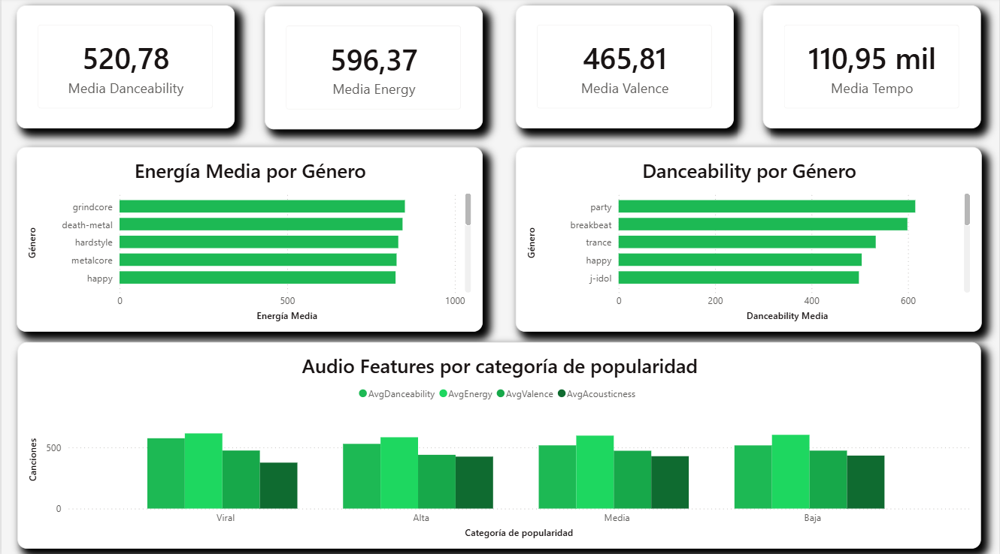
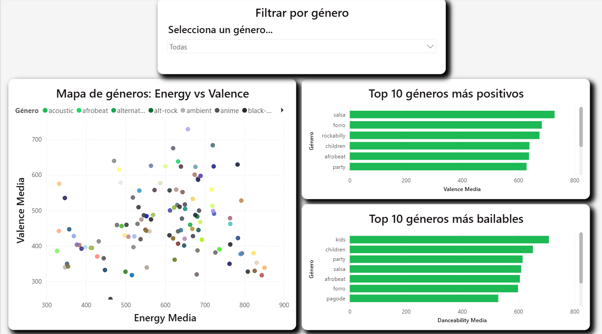
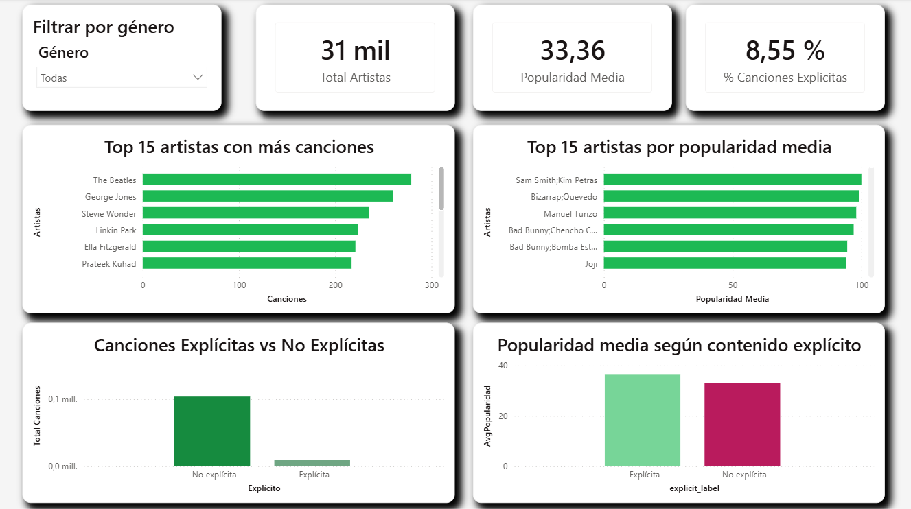
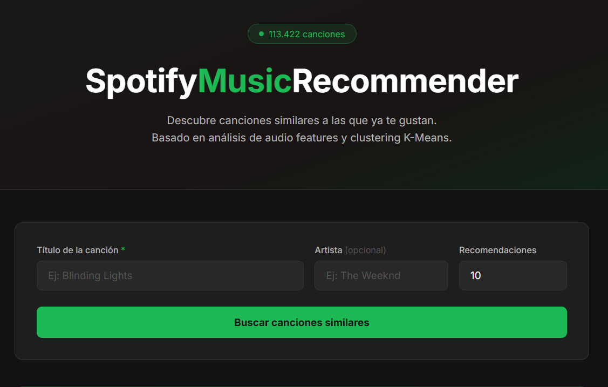
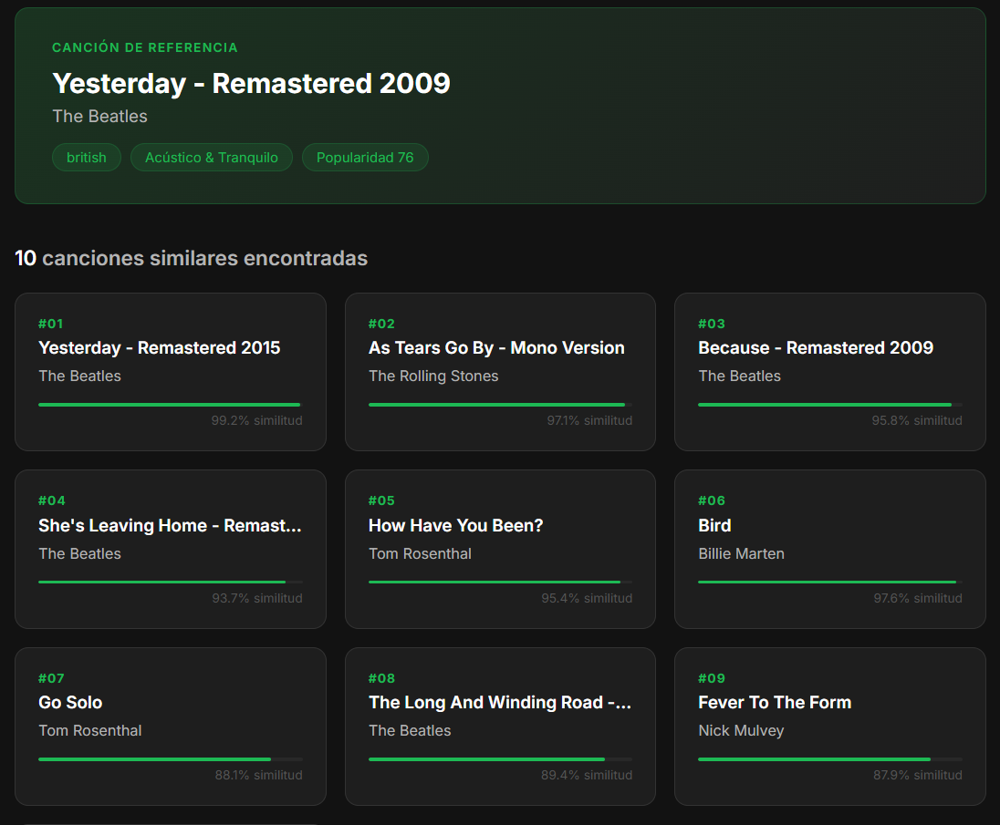

# 🎵 Spotify Music Recommender

Sistema de análisis y recomendación musical construido sobre un dataset de 113.000 canciones extraído de Spotify. El proyecto cubre el ciclo completo de datos: limpieza, análisis exploratorio, segmentación mediante clustering y un modelo recomendador basado en similitud de audio features.

---
## 📌 Objetivos

- Analizar las características de audio de más de 113.000 canciones de Spotify
- Segmentar el catálogo en grupos musicales coherentes mediante K-Means
- Desarrollar un sistema recomendador content-based por similitud coseno
- Visualizar los insights del análisis en un dashboard interactivo de Power BI

## Estructura del proyecto

```
SpotifyMusicRecommender/
├── data/
│   ├── raw/                          # Dataset original de Kaggle
│   ├── processed/                    # Datos limpios y transformados
│   ├── external/                     # Datasets de terceros
│   └── img/                          # Imágenes para la documentación
├── notebooks/
│   ├── 02_eda_audio_features.ipynb   # Análisis exploratorio
│   ├── 03_clustering.ipynb           # Segmentación K-Means
│   └── 04_recommender_model.ipynb    # Modelo recomendador
├── src/
│   ├── api/                          # Cliente Spotify API (OAuth)
│   ├── data/                         # Limpieza y transformación
│   ├── models/                       # Modelos entrenados
│   ├── visualization/                # Helpers de visualización
│   └── app/                          # Aplicación web Flask
│       ├── app.py
│       ├── static/
│       │   ├── style.css
│       │   └── script.js
│       └── templates/
│           └── index.html
├── dashboard/                        # Dashboard Power BI (.pbix) y tema
├── reports/
│   └── figures/                      # Gráficos exportados
├── .env.example                      # Variables de entorno necesarias
├── requirements.txt
└── README.md
```

## Dataset

- **Fuente**: [Spotify Tracks Dataset — Kaggle](https://www.kaggle.com/datasets/maharshipandya/-spotify-tracks-dataset)
- **Canciones**: 113.422 tras limpieza
- **Géneros**: 114 géneros únicos (~1.000 canciones por género)
- **Artistas**: 31.437 artistas únicos
- **Features**: danceability, energy, valence, tempo, acousticness, instrumentalness, speechiness, liveness, loudness

--- 
## 🔍 Análisis Exploratorio (EDA)

El análisis exploratorio revela los patrones principales del catálogo musical:

- Ninguna feature de audio supera **0.10 de correlación con popularidad** — el éxito de una canción depende más de factores externos que de su sonido
- **Energy y loudness** presentan la correlación más alta entre features (0.76)
- **Acousticness** correlaciona negativamente con energy (−0.73) y loudness (−0.59)
- El dataset está **balanceado por género**: aproximadamente 1.000 canciones por género
- Solo el **8.5% del catálogo** es contenido explícito


---
## 🔵 Clustering

Segmentación del catálogo en 7 clusters mediante **K-Means** sobre las 9 features de audio escaladas con StandardScaler.

- **Método de selección de k**: Elbow Method + Silhouette Score (k=7, score=0.199)
- **Reducción de dimensionalidad**: PCA 2D (varianza explicada: 47.9%)

| Cluster | Nombre                   | Características principales               |
| ------- | ------------------------ | ----------------------------------------- |
| 0       | Conciertos en Vivo       | Alta energy, alto liveness                |
| 1       | Acústico & Tranquilo     | Alta acousticness, baja energy            |
| 2       | Instrumental Clásico     | Alta instrumentalness, muy baja energy    |
| 3       | Fiesta & Baile           | Alta danceability, alta valence           |
| 4       | Electrónico Instrumental | Alta instrumentalness, alta energy        |
| 5       | Rock & Intenso           | Máxima energy, loudness y tempo más altos |
| 6       | Spoken Word & Rap        | Muy alto speechiness, alta acousticness   |


---

## 🎯 Modelo Recomendador

Sistema **content-based** que recomienda canciones similares dado el título de una canción de referencia.

**Funcionamiento:**

1. Localiza la canción de referencia en el dataset
2. Filtra el espacio de búsqueda por **mismo género y mismo cluster**
3. Calcula la **similitud coseno** entre los vectores de audio features
4. Ordena por un **score combinado** (70% similitud + 30% popularidad)
5. Elimina títulos duplicados y devuelve las top-N recomendaciones

**Ejemplo de uso:**
 ```python 

recomendar_por_genero_cluster("Blinding Lights", artista="Weeknd", n=10)

 ``` 

🎵 Canción de referencia:

**Blinding Lights — The Weeknd**

Género: *pop* | Cluster: *Rock & Intenso*

Popularidad: **87**

🔍 Espacio de búsqueda: **842 canciones**

`track_name artists popularity similitud score`

`1 Save Your Tears The Weeknd 85 0.9981 0.923`
`2 Levitating Dua Lipa 84 0.9978 0.911`
`...`




---

## 📈 Dashboard Power BI

Dashboard interactivo de 5 páginas construido sobre el dataset procesado:

| Página | Contenido |
|--------|-----------|
| 1. Resumen General | KPIs globales, distribución por popularidad y géneros |
| 2. Audio Features | Distribución de features por género y categoría de popularidad |
| 3. Mapa de Géneros | Scatter energy vs valence, géneros más bailables y positivos |
| 4. Top Artistas | Ranking por canciones y popularidad, análisis de contenido explícito |
| 5. Clusters | Perfil de audio features y popularidad por cluster |





---

## 🌐 Aplicación Web
 
Interfaz web construida con **Flask** que permite interactuar con el modelo recomendador de forma visual.
 


 
**Características:**
- Búsqueda por título de canción con artista opcional
- Selección del número de recomendaciones (5, 10, 15 o 20)
- Tarjetas animadas con barra de similitud
- Manejo de errores y estado de carga
**Arrancar la aplicación:**
 
```bash
conda activate spotify-recommender
cd src/app
python app.py
```
 
Abre `http://localhost:5000` en el navegador.
 
**Endpoints disponibles:**
 
| Endpoint | Descripción |
|----------|-------------|
| `GET /` | Interfaz web principal |
| `GET /health` | Estado de la API y número de canciones cargadas |
| `GET /recomendar?titulo=...&artista=...&n=10` | Devuelve JSON con recomendaciones |
 
---

## ⚙️ Instalación
 
```bash
# 1. Clonar el repositorio
git clone https://github.com/alegonzjur/SpotifyMusicRecommender.git
cd SpotifyMusicRecommender
 
# 2. Crear entorno virtual
conda create -n spotify-recommender python=3.11
conda activate spotify-recommender
 
# 3. Instalar dependencias
pip install -r requirements.txt
 
# 4. Descargar el dataset
# https://www.kaggle.com/datasets/maharshipandya/-spotify-tracks-dataset
# Colocar dataset.csv en data/raw/
```
 
---


## 🛠️ Stack tecnológico

| Categoría        | Herramientas                |
| ---------------- | --------------------------- |
| Lenguaje         | Python 3.11                 |
| Análisis         | pandas, numpy               |
| Machine Learning | scikit-learn                |
| Visualización    | matplotlib, seaborn, plotly |
| Dashboard        | Power BI Desktop            |
| Aplicación web | Flask, HTML, CSS, JavaScript |
| Entorno          | Anaconda, Windsurf (Devin)  |

---
 
## 🚀 Estado del proyecto
 
| Fase | Estado |
|------|--------|
| Limpieza y preprocesado | ✅ |
| EDA | ✅ |
| Clustering K-Means k=7 | ✅ |
| Modelo recomendador content-based | ✅ |
| Dashboard Power BI 5 páginas | ✅ |
| Aplicación web Flask | ✅ |

---

## 👤 Autor

**Alejandro González** — [GitHub](https://github.com/alegonzjur) · [Portfolio](https://alegonzjur.github.io)