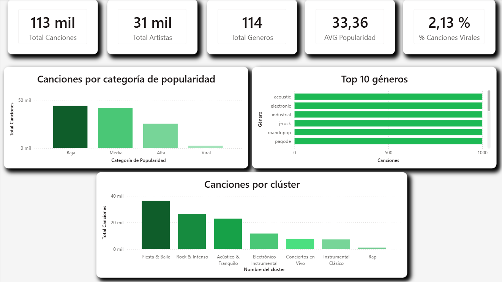
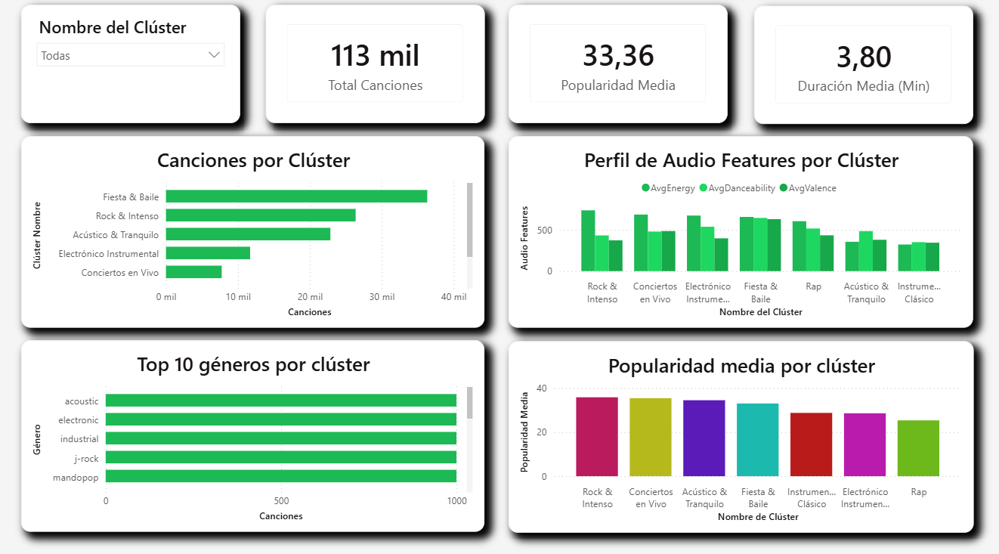

# Dashboard Power BI — Spotify Music Recommender

Dashboard interactivo de 5 páginas construido sobre el dataset procesado de 113.422 canciones de Spotify. Permite explorar las características de audio, la segmentación por clusters y el ranking de artistas de forma visual e interactiva.

---
## Archivos

- `DB.pbix` — archivo principal del dashboard
- `theme_spotify.json` — tema personalizado con paleta de colores del proyecto

---
## Fuente de datos

El dashboard se conecta a `data/processed/tracks_powerbi.csv`, generado al final del notebook `04_preprocess_pbi.ipynb` tras aplicar un preprocesamiento previo.

Para actualizar los datos: **Inicio → Actualizar** en Power BI Desktop.

---
## Páginas 

### 1. Resumen General
Vista general del catálogo con los KPIs principales.
- **KPIs:** Total canciones, artistas únicos, géneros unidos, popularidad media, % canciones virales.
- **Canciones por categoría de popularidad:** Baja, media, alta, viral.
- **Top 10 géneros** por número de canciones.
- **Canciones por clúster**

---
### 2. Audio Features
Análisis de las características de audio por género y categoría de popularidad.
- **KPIs:** Media de danceability, energy, valence, tempo.
- **Top 15 géneros por energy media**
- **Top 15 géneros por danceability**
- **Audio features por categoría de popularidad:** comparativa de danceability, energy, valence y acousticness.

---

### 3. Mapa de Géneros
Visualización espacial de los géneros según sus características de audio.
- **Slicer:** filtro por género.
- **Scatter Energy vs Valence:** cada punto representa un género, posicionado según su energy y valence medias.
- **Top 10 géneros más positivos** (mayor valence media)
- **Top 10 géneros más bailables** (mayor danceability media)

---
### 4. Top Artistas 
Ranking de artistas  y análisis de contenido explícito.
- **Slicer**: filtro por género (desplegable)
- **KPIs**: total artistas, popularidad media, % canciones explícitas
- **Top 15 artistas con más canciones**
- **Top 15 artistas por popularidad media** (mínimo 10 canciones)
- **Canciones explícitas vs no explícitas**
- **Popularidad media según contenido explícito**

---

### 5. Clusters
Exploración de los 7 clusters generados por el modelo K-Means.
- **Slicer**: filtro por cluster (mosaico)
- **KPIs**: total canciones, popularidad media, duración media
- **Canciones por cluster**
- **Perfil de audio features por cluster**: energy, danceability y valence
- **Top 10 géneros por cluster**
- **Popularidad media por cluster**

## Medidas DAX

Todas las medidas están centralizadas en las tablas `_Medidas` y `_AudioFeat`:

| Medida                   | Descripción                                      |
| ------------------------ | ------------------------------------------------ |
| `Total Canciones`        | COUNTROWS de la tabla tracks                     |
| `Total Artistas`         | DISTINCTCOUNT de artists                         |
| `Total Géneros`          | DISTINCTCOUNT de track_genre                     |
| `Popularidad Media`      | AVERAGE de popularity                            |
| `% Canciones Virales`    | % de canciones con popularity_category = "Viral" |
| `% Canciones Explícitas` | % de canciones con explicit = TRUE               |
| `Duración Media Min`     | AVERAGE de duration_ms / 60000                   |
| `Media Danceability`     | AVERAGE de danceability                          |
| `Media Energy`           | AVERAGE de energy                                |
| `Media Valence`          | AVERAGE de valence                               |
| `Media Tempo`            | AVERAGE de tempo                                 |
| `Media Acousticness`     | AVERAGE de acousticness                          |

